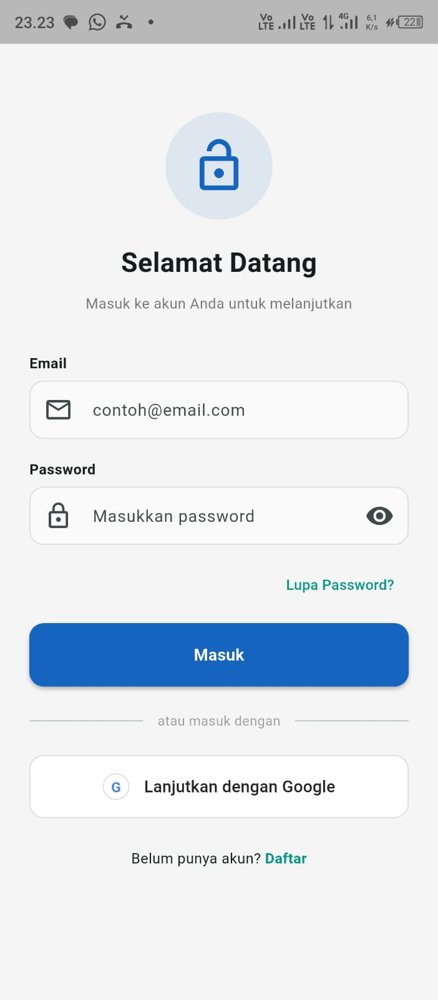
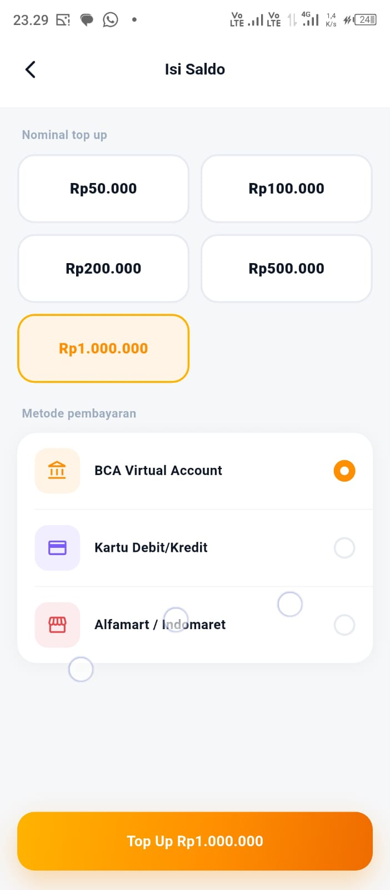
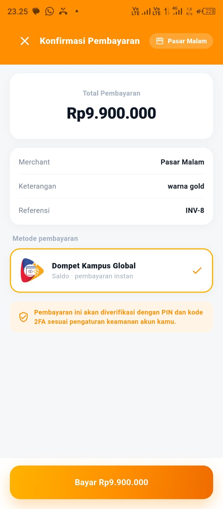
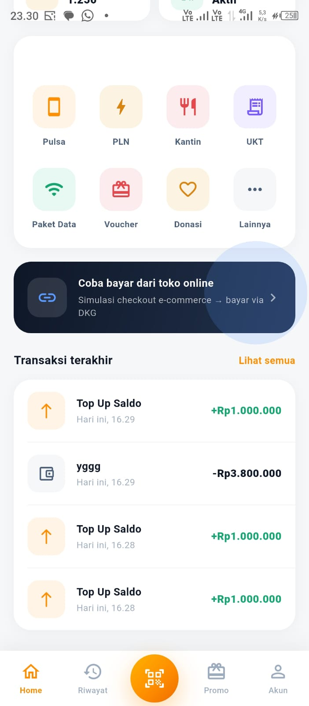

# dompetkita
# DompetKita

<p align="center">
  
</p>

<p align="center">
  
  
  
  
  
  
  
</p>


# Deskripsi

**DompetKita **merupakan aplikasi **E-Money berbasis Flutter** yang dikembangkan sebagai proyek **Ujian Akhir Semester (UAS) Mata Kuliah Aplikasi Mobile Lanjutan**.

Aplikasi ini dirancang sebagai digital wallet yang dapat digunakan untuk melakukan pembayaran pada aplikasi E-Commerce melalui mekanisme **App-to-App Integration** menggunakan **Deep Link**.

Selain sebagai dompet digital, aplikasi ini juga mengimplementasikan berbagai teknologi modern seperti:

- Firebase Authentication
- Firebase Cloud Messaging (FCM)
- JWT Authentication
- REST API
- Deep Link
- Two-Factor Authentication (OTP)
- Secure Storage

Seluruh proses transaksi dilakukan secara aman melalui backend berbasis **Go (Gin Framework)** yang terhubung dengan database **MySQL**.


# Tujuan Pengembangan

Pengembangan aplikasi ini bertujuan untuk:

- Mengimplementasikan aplikasi mobile menggunakan Flutter.
- Menerapkan komunikasi antar aplikasi menggunakan Deep Link.
- Menghubungkan aplikasi Flutter dengan REST API.
- Mengimplementasikan sistem autentikasi menggunakan Firebase.
- Mengimplementasikan JWT Authentication.
- Mengimplementasikan Two Factor Authentication (OTP).
- Mengirim notifikasi transaksi menggunakan Firebase Cloud Messaging.
- Mengelola transaksi pembayaran digital secara aman.
- Menerapkan Clean Architecture pada Flutter.


# Fitur Utama

## Authentication

- Login menggunakan Firebase Authentication
- Login menggunakan Google Account
- Email Verification
- JWT Authentication
- Auto Login menggunakan Secure Storage
- Logout


## Wallet

- Menampilkan saldo pengguna
- Menampilkan informasi akun
- Riwayat transaksi
- Detail transaksi
- Refresh saldo


## Pembayaran

- Pembayaran menggunakan saldo E-Money
- Integrasi dengan aplikasi E-Commerce
- Konfirmasi pembayaran
- Status transaksi
- Validasi transaksi


## Security

- Firebase Authentication
- JWT Authentication
- Secure Storage
- OTP Verification (2FA)
- Token Validation
- Authorization Middleware


## Notification

- Firebase Cloud Messaging (FCM)
- Push Notification
- Background Notification
- Foreground Notification

## Deep Link

- App-to-App Integration
- Menerima request pembayaran
- Mengirim hasil transaksi
- Redirect kembali ke aplikasi Merchant

# Tech Stack

## Mobile

- Flutter
- Dart
- Material Design 3


## State Management

- flutter_bloc
- provider

## Backend

- Golang
- Gin Framework
- GORM
- MySQL

Repository Backend

https://github.com/ChaerulUmamMaulana/BackEnd_DompetKita

## Firebase

- Firebase Authentication
- Firebase Cloud Messaging
- Firebase Core


## Local Storage

- Flutter Secure Storage
- Shared Preferences

## Networking

- Dio
- REST API
- JWT


## Routing

- Go Router
- Deep Link (App Links)


# Arsitektur Aplikasi

Project ini menggunakan pendekatan **Clean Architecture** sehingga setiap layer memiliki tanggung jawab yang jelas.

```text
┌────────────────────────────┐
│          UI Layer          │
│        (Screens)           │
└────────────┬───────────────┘
             │
             ▼
┌────────────────────────────┐
│      BLoC / Provider       │
│    State Management        │
└────────────┬───────────────┘
             │
             ▼
┌────────────────────────────┐
│       Repository           │
└────────────┬───────────────┘
             │
             ▼
┌────────────────────────────┐
│      Remote Data Source    │
│      REST API (Dio)        │
└────────────┬───────────────┘
             │
             ▼
┌────────────────────────────┐
│ Backend Go + Gin + MySQL   │
└────────────────────────────┘

# Struktur Folder

```text
lib
│
├── app/
│   ├── routes/
│   ├── theme/
│   └── constants/
│
├── core/
│   ├── services/
│   ├── network/
│   ├── utils/
│   └── storage/
│
├── features/
│   ├── auth/
│   ├── wallet/
│   ├── payment/
│   ├── profile/
│   └── notification/
│
├── models/
│
├── repositories/
│
├── widgets/
│
└── main.dart

# Dependensi Utama

Project menggunakan beberapa package utama seperti:

- flutter_bloc
- provider
- dio
- go_router
- firebase_core
- firebase_auth
- firebase_messaging
- flutter_secure_storage
- shared_preferences
- app_links
- google_sign_in
- flutter_local_notifications

# Cara Menjalankan Project

## Prasyarat

Pastikan perangkat telah terinstall:

| Software | Versi |
|----------|--------|
| Flutter | 3.x |
| Dart | 3.x |
| Android Studio | Latest |
| Visual Studio Code | Latest |
| Git | Latest |
| Go | 1.24+ |
| MySQL | 8.x |

---

# Clone Repository

## Frontend (Flutter)

```bash
git clone https://github.com/ChaerulUmamMaulana/DompetKita.git


Masuk ke project

```bash
cd DompetKita


## Backend

Clone backend

```bash
git clone https://github.com/ChaerulUmamMaulana/BackEnd_DompetKita.git

Masuk ke project

```bash
cd BackEnd_DompetKita


# Install Dependency Flutter

Jalankan

```bash
flutter pub get

Pastikan tidak terdapat error.


# Konfigurasi Firebase

Project ini menggunakan Firebase sebagai layanan autentikasi dan notifikasi.

Layanan Firebase yang digunakan:

- Firebase Authentication
- Firebase Cloud Messaging (FCM)
- Firebase Core

Tambahkan file konfigurasi sesuai platform:

Android

android/app/google-services.json

iOS

```
ios/Runner/GoogleService-Info.plist

Kemudian jalankan

```bash
flutterfire configure


# Konfigurasi Backend

Masuk ke folder backend

```bash
cd BackEnd_DompetKita

Install dependency Go

```bash
go mod tidy

Buat file

```
.env

Contoh konfigurasi

```env
APP_PORT=8080

DB_HOST=localhost
DB_PORT=3306
DB_USER=chaerulumam
DB_PASSWORD=Arulganteng21
DB_NAME=e_money

JWT_SECRET=arulumamgantengbangetsekalinengoklangsungkelepek
JWT_EXPIRE_HOURS=24
```


# Firebase Admin SDK

Backend menggunakan Firebase Admin SDK.

Tambahkan file

```
firebase_service_account.json

pada root project backend.

> **Catatan**
>
> File ini bersifat rahasia sehingga **tidak disimpan di repository GitHub** dan harus ditambahkan secara manual.

# 🗄 Database

Project menggunakan database **MySQL**.

Buat database

```sql
CREATE DATABASE dompetkita;
```

Kemudian jalankan migrasi sesuai project backend.

---

# Menjalankan Backend

Jalankan

```bash
go run main.go

Jika berhasil akan muncul

```text
Server berjalan di http://localhost:8080

# ▶ Menjalankan Flutter

Pastikan emulator atau perangkat Android sudah aktif.

Kemudian jalankan

```bash
flutter run

atau

```bash
flutter run --release


# Build APK

Untuk membuat APK Release

```bash
flutter build apk --release

Hasil APK dapat ditemukan pada

```
build/app/outputs/flutter-apk/

# Authentication Flow

Aplikasi menggunakan dua jenis autentikasi:

1. Firebase Authentication
2. Backend JWT Authentication

Alur autentikasi

Flutter
      │
      ▼
Firebase Authentication
      │
      ▼
Firebase ID Token
      │
      ▼
Backend Go
      │
Verifikasi Token
      │
      ▼
Generate JWT
      │
      ▼
Flutter Secure Storage
```

JWT digunakan untuk mengakses seluruh endpoint backend.

---

# REST API

Backend menyediakan REST API berbasis Gin Framework.

Contoh endpoint

| Method | Endpoint |
|---------|----------|
| POST | /v1/auth/verify-token |
| POST | /v1/auth/fcm-token |
| GET | /v1/profile |
| GET | /v1/wallet |
| GET | /v1/transactions |
| POST | /v1/payment |
| POST | /v1/topup |

Semua endpoint menggunakan

```
Authorization: Bearer <JWT Token>


# Struktur Arsitektur

```
Flutter App
      │
      │
      ▼
Firebase Authentication
      │
      ▼
Backend API (Go + Gin)
      │
      ▼
MySQL Database
      │
      ▼
Firebase Cloud Messaging
```


# Penyimpanan Data Lokal

Project menggunakan:

- Flutter Secure Storage
- Shared Preferences

Secure Storage digunakan untuk menyimpan

- JWT Token
- Refresh Token (jika digunakan)
- Session Login

Shared Preferences digunakan untuk

- Theme
- Setting aplikasi
- Preferensi pengguna


# Keamanan

DompetKita menerapkan beberapa mekanisme keamanan

✅ Firebase Authentication

✅ JWT Authentication

✅ HTTPS API

✅ Secure Storage

✅ Two Factor Authentication (OTP)

✅ Token Validation

✅ Authorization Middleware

Hal ini bertujuan untuk memastikan bahwa transaksi hanya dapat dilakukan oleh pengguna yang telah terverifikasi.

# Arsitektur Sistem

DompetKita dibangun menggunakan arsitektur client-server yang memanfaatkan layanan Firebase sebagai Authentication Provider serta backend REST API berbasis Go (Gin Framework).

```
                    +----------------------+
                    |      Flutter App     |
                    +----------+-----------+
                               |
                               | Login
                               |
                               ▼
                  Firebase Authentication
                               |
                               | Firebase ID Token
                               ▼
                     Backend API (Go + Gin)
                               |
             +-----------------+-----------------+
             |                                   |
             ▼                                   ▼
        MySQL Database                  Firebase Cloud Messaging
             |                                   |
             +---------------+-------------------+
                             |
                             ▼
                       Push Notification
```


# Fitur Deep Link

DompetKita mendukung **Deep Link** sehingga pengguna dapat langsung membuka halaman tertentu di dalam aplikasi tanpa harus menavigasi secara manual.

Contoh penggunaan:

```
dompetkita://payment

akan langsung membuka halaman pembayaran.

Contoh lainnya

dompetkita://topup

langsung menuju halaman Top Up.

```
dompetkita://wallet

langsung menuju halaman Wallet.

Deep Link mempermudah integrasi dengan:

- QR Code
- Merchant
- Email
- Push Notification
- Website


# Firebase Cloud Messaging (FCM)

Aplikasi menggunakan Firebase Cloud Messaging untuk mengirimkan notifikasi secara real-time.

Contoh notifikasi:

- Saldo berhasil bertambah
- Pembayaran berhasil
- Pembayaran gagal
- Transfer berhasil
- Promo terbaru
- Verifikasi akun
- OTP Login

Flow FCM

```
Firebase Console
        │
        ▼
Firebase Cloud Messaging
        │
        ▼
Backend Go
        │
        ▼
FCM Token User
        │
        ▼
Flutter App

Setelah pengguna login, aplikasi akan:

1. Mengambil FCM Token.
2. Mengirim token ke backend.
3. Backend menyimpan token pada database.
4. Token digunakan saat mengirim Push Notification.

# Two-Factor Authentication (2FA)

DompetKita menerapkan Two-Factor Authentication (2FA) menggunakan One Time Password (OTP).

Tahapan autentikasi

```
Login
    │
    ▼
Email & Password
    │
    ▼
Firebase Authentication
    │
    ▼
OTP Verification
    │
    ▼
Backend JWT
    │
    ▼
Dashboard
```

Keuntungan penggunaan 2FA

- Mengurangi risiko pembajakan akun.
- Menambah keamanan transaksi.
- Mencegah login dari perangkat tidak dikenal.
- Memberikan perlindungan tambahan terhadap pencurian password.

---

# Alur Top Up Saldo

```
User
 │
 ▼
Halaman Top Up
 │
 ▼
Input Nominal
 │
 ▼
Backend API
 │
 ▼
Validasi
 │
 ▼
Database
 │
 ▼
Saldo Bertambah
 │
 ▼
Push Notification
```


# Alur Pembayaran

```
User
 │
 ▼
Pilih Merchant
 │
 ▼
Masukkan Nominal
 │
 ▼
Konfirmasi
 │
 ▼
Backend API
 │
 ▼
Validasi Saldo
 │
 ▼
Kurangi Saldo
 │
 ▼
Simpan Riwayat
 │
 ▼
Notifikasi Berhasil
```


# Alur Login

```
Flutter
    │
    ▼
Firebase Authentication
    │
    ▼
Firebase ID Token
    │
    ▼
Backend Verify Token
    │
    ▼
Generate JWT
    │
    ▼
Flutter Secure Storage
    │
    ▼
Dashboard
```


# Struktur Folder Flutter

```
lib
│
├── config
├── constants
├── core
├── models
├── providers
├── repositories
├── routes
├── screens
├── services
├── utils
├── widgets
└── main.dart
```

---

# Struktur Folder Backend

```
backend
│
├── config
├── handlers
├── middleware
├── models
├── repositories
├── routes
├── services
├── utils
├── firebase_service_account.json
├── go.mod
└── main.go
```

---

# Database

DompetKita menggunakan MySQL sebagai database utama.

Contoh tabel utama

- users
- wallets
- transactions
- payments
- topups
- notifications

Relasi sederhana

```
User
 │
 ├──────── Wallet
 │
 ├──────── Transaction
 │
 └──────── Notification
```

---

# Keamanan Data

Beberapa mekanisme keamanan yang diterapkan:

- Firebase Authentication
- JWT Authentication
- Secure Storage
- HTTPS Communication
- Authorization Middleware
- Token Validation
- Email Verification
- Two Factor Authentication
- Firebase Cloud Messaging

---

# Future Development

Beberapa fitur yang direncanakan pada versi berikutnya:

- QRIS Payment
- Virtual Account
- Transfer Antar Bank
- NFC Payment
- Face Recognition Login
- Fingerprint Authentication
- Multi Wallet
- Riwayat Transaksi dalam PDF
- Dashboard Analitik Pengeluaran
- Integrasi AI Financial Assistant

# Tampilan Aplikasi

## Login



## Register


---

## Home


---


## Top Up


---

## Payment


---

## Transaction History


---


# Demo Aplikasi

Demo aplikasi dapat dilihat melalui video berikut


```
https://youtu.be/xxxxxxxx
```

---


# Penutup

DompetKita merupakan aplikasi dompet digital (E-Money) berbasis Flutter yang mengintegrasikan Firebase Authentication, Backend REST API menggunakan Go (Gin Framework), MySQL sebagai database, serta Firebase Cloud Messaging untuk memberikan pengalaman transaksi digital yang aman, cepat, dan modern.

Project ini dikembangkan sebagai implementasi pembelajaran pada mata kuliah Technopreneurship dengan mengedepankan aspek keamanan, kemudahan penggunaan, dan pengembangan aplikasi mobile modern.

Semoga repository ini dapat menjadi referensi bagi mahasiswa maupun developer lain dalam mempelajari implementasi Flutter, Firebase, Go Backend, JWT Authentication, serta integrasi layanan cloud pada aplikasi mobile.
